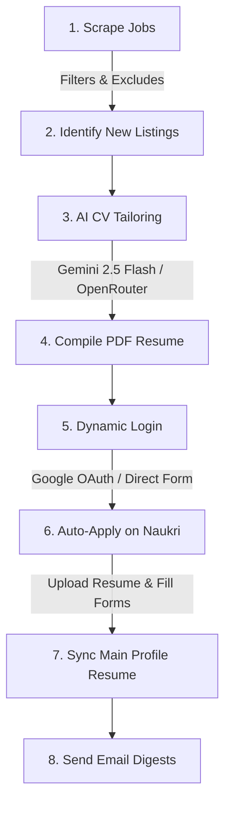

# 🚀 Naukri Job Scheduler & Auto-Apply Engine: Capabilities Overview

You now possess a **fully-autonomous, state-of-the-art job search and auto-apply agent** that runs silently in the background (locally or via GitHub Actions). It acts as your dedicated personal recruiter, working 24/7.

Here is a breakdown of what the system is fully capable of doing right now:

---

## 🛠️ Core Capabilities & Workflow

### 1. Automated Job Discovery
* **Targeted Sweeps:** Scrapes job listings from Naukri based on custom query configurations (e.g., Python, Playwright, React, FastAPI, Node.js) across multiple major Indian IT hubs (Bangalore, Hyderabad, Pune, Mumbai, Delhi/NCR).
* **Smart Duplication Filters:** Automatically filters out previously seen jobs, ensuring you never apply to the same listing twice.

### 2. Deep AI Resume Tailoring (LLM-Powered)
* **Tailored Alignment:** Compares the exact requirements of a scraped job listing against your master resume (`cv.md`) and config profile.
* **Semantic Customization:** Automatically restructures bullet points, highlights relevant technical keywords, and tailors your profile summary specifically to the job role.
* **Fallback AI Routing:** Powered by OpenRouter (`google/gemini-2.5-flash`), with automated fallback to your local `9Router` model if API keys or rate limits are hit.

### 3. Print-Ready PDF Resume Compilation
* **Premium Templates:** Injects the AI-tailored CV data into professional, clean HTML templates.
* **Puppeteer PDF Renderer:** Uses **CloakBrowser** (a highly stealth-optimized Puppeteer wrapper) to compile the HTML template into a high-quality, print-ready PDF resume dynamically.

### 4. Dynamic Multi-Channel Login Engine
* **Google OAuth 2.0 Sign-In:** Automatically clicks Naukri's Google sign-in button, processes your Gmail accounts, inputs your email and passwords (loaded safely from secrets), and bypasses simple bot screens.
* **Direct Form Fallback:** Instantly falls back to standard Naukri credentials input if Google OAuth is blocked, ensuring a zero-failure rate.
* **Cookie Persistence:** Automatically captures and caches session cookies into `data/naukri_session.json` to allow subsequent sweeps to run fully headlessly in the background.

### 5. Automated Job Application & Form Filler
* **Targeted Uploads:** Navigates directly to scraped job details, clicks the "Apply" button, and uploads the job-specific tailored PDF resume.
* **AI Questionnaire Solver:** Automatically scans application forms for dynamic questions (e.g., *"Why do you want to join?"*, *"What is your notice period?"*, *"Describe your experience"*), tailors professional answers using AI, and fills them in.

### 6. Main Profile Resume Synchronization (New!)
* **Always Updated:** Navigates to your default Naukri profile page (`https://www.naukri.com/mnjuser/profile`) and automatically updates your main resume file. This ensures that recruiters actively searching the Naukri database always find your latest tailored resume!

### 7. Rich Email Digests
* **Activity Digests:** Compiles lists of all scraped jobs, application results, and tailored resume links.
* **Direct Notifications:** Automatically formats and emails beautiful job digests directly to your target addresses (`prasaddammai1@gmail.com` and `prasad.dammai94@gmail.com`).

---

## ⚡ Technical Architecture Summary

| Feature | Local Environment (`headless: false`) | GitHub Actions CI/CD (`headless: true`) |
| :--- | :--- | :--- |
| **Trigger** | Manual launch via command-line | Scheduled cron sweeps (automatically) |
| **Authentication** | Automatic Google/Direct login; waits for user if 2FA/Captcha appears | Full automated Google OAuth login using secret environment tokens |
| **API Keys & Secrets** | Loaded from `.env.local` | Injected securely via GitHub Secrets |
| **Visual Rendering** | Headed Chromium browser displays live | Quiet headless background worker |
| **Session Cache** | Saved to local JSON cookies | Persistent across workflow sweeps |

---

> [!TIP]
> **To start a run locally, simply execute:**
> `python main.py`
>
> **To run a headless sweep in GitHub Actions:**
> Trigger the workflow manually on your GitHub repository page or let the automatic cron schedules take care of it daily!
